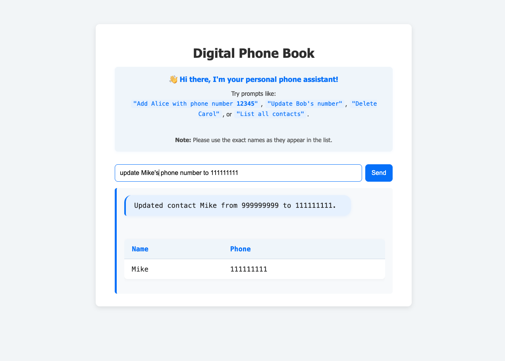

# 📖 Digital Phone Book (LLM-powered)

A web application that acts as a smart digital phone book.  
Manage your contacts using **natural language**—add, update, delete, retrieve, or list contacts by simply typing commands in plain English.  
The backend uses a Large Language Model (LLM, e.g. OpenAI GPT) to interpret user requests and execute the appropriate database actions.

---

## ✨ Features

- **Add, update, delete, retrieve, and list contacts** (Name & Phone Number)
- **Natural language interface** powered by LLM (LangChain + OpenAI)
- **Simple, modern web frontend**
- **Relational database** (PostgreSQL)
- **Containerized** (Docker Compose)

---

## 🛠️ Tech Stack

- **Frontend**: HTML/CSS/JavaScript, served by Nginx
- **Backend**: Python (Flask, LangChain, SQLAlchemy, Pydantic)
- **Database**: PostgreSQL
- **LLM**: OpenAI GPT (via API)
- **Containerization**: Docker, Docker Compose

---

## 🚀 Running Locally (with Docker Compose)

### 1. **Clone the repository**

```sh
git clone https://github.com/yourusername/llm-phonebook.git
cd llm-phonebook
```

### 2. **Set up your OpenAI API key**

- Create a `.env` file in the `backend/` directory. See `.env-template` for the proposed structure for the file:
    ```env
    OPENAI_API_KEY=...
    HOST=0.0.0.0
    PORT=5001
    DATABASE_URL=...
    ```

### 3. **Start the services**

```sh
docker compose up --build
```

- This will start:
  - The **PostgreSQL database** (`db`)
  - The **Python Flask backend** (`backend`)
  - The **Nginx frontend** (`frontend`)
- The frontend will be available at:  
  [http://localhost:3000](http://localhost:3000)

---

## 🧑‍💻 Usage

- Open [http://localhost:3000](http://localhost:3000) in your browser.
- Type your command using **plain English** (see examples below).
- The result and your contacts will appear below.

**Example prompts:**
- `Add Alice with phone number 12345`
- `What is Bob's number?`
- `Update Alice's number to 67890`
- `Delete Carol`
- `List all contacts`
- `Rename Alice to Alicia`

---

## ⚙️ Project Structure

```
llm-phonebook/
├── backend/
│   ├── app.py                  # Flask API server
│   ├── phonebook_agent.py      # LLM agent logic 
│   ├── agent_tools.py          # CRUD functions
│   ├── models.py               # SQLAlchemy models
│   ├── requirements.txt
│   └── .env
├── frontend/
│   ├── index.html
│   └── styles.css
├── docker-compose.yml
└── README.md
```

---

## 📝 API (Backend)

- **POST `/api/llm/contacts`**
    - **Body:** `{ "command": "<your natural language command>" }`
    - **Returns:**  
      ```json
      {
        "message": "Operation result message.",
        "contacts": [ 
          {"name": "Alice", "phone": "12345"}
        ]
      }
      ```

---

## 🖼️ Frontend

Here are some screenshots of the application in action:

<p align="center">
    
</p>

<p align="center">
    
</p>

<p align="center">
    
</p>


## 📂 Database

- The `Contact` model contains:
  - `id` (autogenerated)
  - `name` (string)
  - `phone` (string)

---

## 📄 License

MIT License.  
© 2025 Your Name or Organization.
